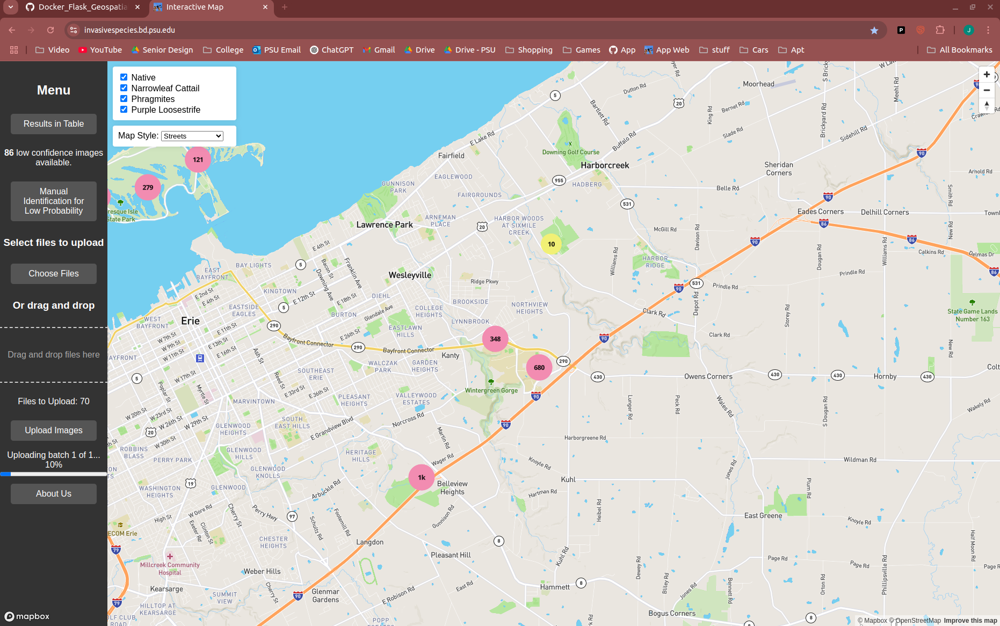

# App for Final Deplyoment System for Senior Design Project 1725
## Classifying Invasive Species Using Drone Images and Deep Learning

### Website Capture:

### About the Project:
Aquatic invasive species of plants are spreading rapidly and harming local ecosystems, especially in areas like Presque Isle State Park, impacting over 70 acres in the area.
The objective of the Classifying Invasive Species Using Drone Images and Deep Learning Project is to design and create a system 
that can automatically identify and map three of the major aquatic invaive plants (Phragmites, Narrow-leaved Cattail, and Purple Loosestrife)
from uploaded images taken via drones, thus facilitating the plants' management and removal.

## Setup
Setup steps to get the website running at [howToSetup.md](https://github.com/ryangrabo/Docker_Flask_Geospatial_Development/blob/main/Documentation/howToSetup.md).

## Deploying the Website:
Steps to actually deploy to website: [Deploying_to_website.md](https://github.com/ryangrabo/Docker_Flask_Geospatial_Development/blob/main/Documentation/Deploying_to_website.md)

## Githubs used to train models:
- Joey: [https://github.com/jgeorge1316/Senior-Design-2025](https://github.com/jgeorge1316/Senior-Design-2025)
- Ziek: [https://github.com/zmoreno2946/Senior-Design-2025-Team-1725](https://github.com/zmoreno2946/Senior-Design-2025-Team-1725)
- Landon: [https://github.com/lcgrafton03/Senior-Design-2025](https://github.com/lcgrafton03/Senior-Design-2025)